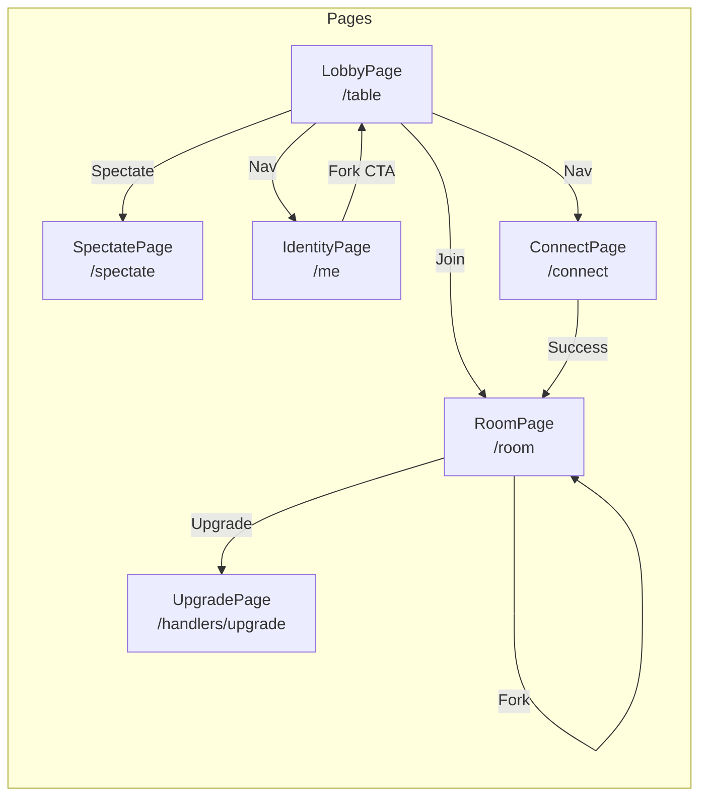
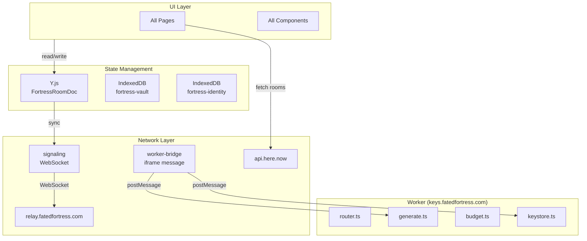

# Fortress UI Architecture — Stitch Compatible

This document specifies the complete UI system for Stitch (Google AI UI generation) to produce pixel-perfect interfaces.

---

## Design System

```
Font: Iosevka (monospace)
Color Palette:
  --ff-black: #0a0a0a
  --ff-white: #fafafa
  --ff-gray-100: #f5f5f5
  --ff-gray-200: #e5e5e5
  --ff-gray-300: #d4d4d4
  --ff-gray-400: #a3a3a3
  --ff-gray-500: #737373
  --ff-gray-600: #525252
  --ff-gray-700: #404040
  --ff-gray-800: #262626
  --ff-gray-900: #171717
  --ff-accent: #22c55e (green-500)
  --ff-accent-hover: #16a34a
  --ff-danger: #ef4444
  --ff-warning: #f59e0b
  --ff-info: #3b82f6

Spacing Scale: 4px base (4, 8, 12, 16, 20, 24, 32, 40, 48, 64)
Border Radius: 4px (sm), 8px (md), 12px (lg), 16px (xl)
Shadows:
  --shadow-sm: 0 1px 2px rgba(0,0,0,0.05)
  --shadow-md: 0 4px 6px -1px rgba(0,0,0,0.1)
  --shadow-lg: 0 10px 15px -3px rgba(0,0,0,0.1)
```

---

## Page Structure

```
App
├── / (redirects to /table)
├── /table [LobbyPage]
├── /room [RoomPage]
├── /spectate [SpectatePage]
├── /me [IdentityPage]
├── /connect [ConnectPage]
└── /handlers/upgrade [UpgradePage]
```

---

## Component Hierarchy — Full Tree

```
App
└── Router
    │
    ├── LobbyPage (/table)
    │   └── LobbyContainer
    │       ├── Header
    │       │   ├── Logo ("Fortress")
    │       │   ├── NavLink (to="/me")
    │       │   └── ThemeToggle
    │       ├── RoomGrid
    │       │   └── RoomCard (×N)
    │       │       ├── RoomCardImage (category thumbnail)
    │       │       ├── RoomCardMeta
    │       │       │   ├── RoomCardTitle (name)
    │       │       │   ├── RoomCardCategory (badge)
    │       │       │   └── ParticipantCount (icon + count)
    │       │       ├── FuelGauge (horizontal bar)
    │       │       │   ├── FuelGaugeFill (width %)
    │       │       │   └── FuelGaugeLabel ("XX% fuel")
    │       │       └── RoomCardActions
    │       │           ├── JoinButton → /room?id={roomId}
    │       │           └── SpectateButton → /spectate?id={roomId}
    │       ├── HereNowFeed
    │       │   └── HereNowCard (×N, from here.now API)
    │       │       ├── HereNowTitle
    │       │       └── HereNowMeta
    │       └── EmptyState (when no rooms)
    │           ├── EmptyStateIcon
    │           └── CreateRoomCTA
    │
    ├── RoomPage (/room)
    │   └── RoomContainer
    │       ├── DemoKeyBanner (conditional)
    │       │   ├── BannerIcon
    │       │   ├── BannerText
    │       │   └── BannerCTA ("Connect Key" → /connect)
    │       ├── KeyPromptBanner (conditional, no key + paid room)
    │       │   ├── BannerIcon
    │       │   ├── BannerText
    │       │   └── BannerCTA
    │       ├── OutputPane
    │       │   ├── OutputHeader
    │       │   │   ├── OutputTitle ("Output")
    │       │   │   └── OutputActions (copy, clear)
    │       │   ├── OutputContent
    │       │   │   ├── MarkdownRenderer (prose)
    │       │   │   ├── CodeBlock (×N, syntax highlighted)
    │       │   │   │   ├── CodeBlockHeader (lang + copy)
    │       │   │   │   └── CodeBlockContent
    │       │   │   └── OutputSkeleton (loading)
    │       │   └── OutputEmpty (initial state)
    │       ├── ControlPane
    │       │   ├── ModelSelector
    │       │   │   ├── SelectorTrigger (current model name)
    │       │   │   └── SelectorDropdown
    │       │   │       └── ModelOption (×N, with icons)
    │       │   ├── PromptInput
    │       │   │   ├── Textarea (placeholder: "Describe what you want...")
    │       │   │   └── CharacterCount
    │       │   ├── GenerateButton
    │       │   │   ├── ButtonIcon (sparkles)
    │       │   │   ├── ButtonText ("Generate" | "Generating...")
    │       │   │   └── ButtonSpinner (during generation)
    │       │   ├── AbortButton (visible during generation)
    │       │   └── FuelGaugeInline
    │       │       ├── FuelIcon
    │       │       └── FuelLabel
    │       └── ReceiptPanel (collapsible)
    │           ├── ReceiptPanelHeader
    │           │   ├── ReceiptPanelTitle ("Receipt")
    │           │   └── ReceiptPanelToggle (chevron)
    │           └── ReceiptList
    │               └── ReceiptCard (×N)
    │                   ├── ReceiptCardHeader
    │                   │   ├── ReceiptModel (icon + name)
    │                   │   ├── ReceiptTimestamp
    │                   │   └── ReceiptPrice (ETH)
    │                   ├── ReceiptPrompt (truncated)
    │                   ├── ForkTree
    │                   │   └── ForkLine (×N, ASCII tree)
    │                   └── ReceiptActions
    │                       ├── ForkButton → /room?seed={receiptId}
    │                       └── CopyButton
    │
    ├── SpectatePage (/spectate)
    │   └── SpectateContainer
    │       ├── SpectateHeader
    │       │   ├── BackButton (→ /table)
    │       │   ├── RoomTitle
    │       │   └── ParticipantList
    │       ├── OutputPane (same as RoomPage)
    │       ├── SpectatorChat
    │       │   ├── ChatHeader ("Spectator Chat")
    │       │   ├── ChatMessages
    │       │   │   └── ChatMessage (×N)
    │       │   │       ├── MessageAvatar
    │       │   │       ├── MessageContent
    │       │   │       └── MessageTimestamp
    │       │   ├── ChatInput
    │       │   │   ├── Textarea (placeholder: "Say something...")
    │       │   │   └── SendButton
    │       │   └── ChatEmpty (no messages yet)
    │       └── SpectateNotice
    │           ├── NoticeIcon
    │           └── NoticeText ("Generation disabled in spectate mode")
    │
    ├── IdentityPage (/me)
    │   └── IdentityContainer
    │       ├── Header
    │       ├── IdentityCard
    │       │   ├── AvatarDisplay (generated from pubkey)
    │       │   ├── PubkeyDisplay (truncated + copy)
    │       │   ├── DisplayNameInput
    │       │   └── ExportButton
    │       │       └── ExportDropdown
    │       │           ├── ExportJSON
    │       │           ├── ExportQR
    │       │           └── ImportButton
    │       ├── ReceiptVault
    │       │   ├── VaultHeader
    │       │   │   ├── VaultTitle ("Receipt Vault")
    │       │   │   └── VaultCount (total receipts)
    │       │   ├── VaultGrid
    │       │   │   └── ReceiptCard (×N, from vault)
    │       │   └── VaultEmpty
    │       └── ForkCTA
    │           ├── CTAIcon
    │           └── CTAText + CTAButton → /table
    │
    ├── ConnectPage (/connect)
    │   └── ConnectContainer
    │       ├── Header
    │       ├── ProviderGrid
    │       │   └── ProviderCard (×N)
    │       │       ├── ProviderIcon
    │       │       ├── ProviderName
    │       │       ├── APIKeyInput
    │       │       │   ├── InputField (type=password)
    │       │       │   ├── InputToggle (show/hide)
    │       │       │   └── InputStatus (validating...)
    │       │       ├── TestResult
    │       │       │   ├── SuccessIcon (✓)
    │       │       │   └── ErrorMessage
    │       │       └── SaveButton
    │       └── HelpText
    │
    └── UpgradePage (/handlers/upgrade)
        └── UpgradeContainer
            ├── UpgradeHeader
            ├── PlanCard (paid access required)
            │   ├── PlanName
            │   ├── PlanPrice
            │   └── PlanFeatures (list)
            ├── PaymentForm
            │   ├── EmailInput
            │   ├── CardInput (Stripe Elements)
            │   └── SubmitButton
            └── BackButton (→ /table)
```

---

## Shared Components

### Button
```
States: default, hover, active, disabled, loading
Variants:
  - primary: green bg, white text
  - secondary: gray bg, white text
  - ghost: transparent, gray text
  - danger: red bg, white text
Sizes: sm (32px), md (40px), lg (48px)
Props: leftIcon?, rightIcon?, loading?, disabled?, variant, size
```

### Input
```
States: default, focus, error, disabled
Variants: text, password, textarea
Props: label?, placeholder, error?, disabled?, type
Features: password toggle (eye icon)
```

### Card
```
Props: interactive? (hover effect), padding
Slots: header?, content, footer?
```

### Modal
```
States: open, closed
Props: title, size (sm/md/lg/xl), closable?
Slots: header, content, footer
Behavior: backdrop click to close (if closable), ESC to close
```

### Dropdown
```
States: closed, open
Props: trigger, placement (bottom-start/bottom-end/top-start/top-end)
Slots: trigger, content, item
Features: keyboard navigation, typeahead
```

### Toast
```
Variants: success, error, warning, info
Props: message, duration (auto-dismiss), action?
Behavior: stacks from bottom-right, auto-dismiss 5s default
```

### Skeleton
```
Props: variant (text|circle|rect), width?, height?, animation
Use: loading states for content
```

### Badge
```
Variants: default, success, warning, danger, info
Props: children, variant
```

### Tooltip
```
Props: content, placement, delay (200ms default)
Behavior: hover/focus to show, mouse-leave/blur to hide
```

---

## User Flows

### Flow: Join Room
```
1. User at /table (LobbyPage)
2. User clicks RoomCard JOIN button
3. Navigate to /room?id={roomId}
4. RoomPage mounts
5. Check for stored API key (via worker-bridge.hasKey)
   ├── No key + demo available → Show DemoKeyBanner
   │   └── User clicks CTA → /connect
   ├── No key + paid room → Show KeyPromptBanner
   │   └── User clicks CTA → /connect
   └── Has key or demo available → Proceed
6. Join room via signaling (WebSocket to relay)
7. Sync Y.js document
8. Render OutputPane + ControlPane
```

### Flow: Generate Output
```
1. User types prompt in PromptInput
2. User selects model (optional, defaults to last used)
3. User clicks GenerateButton
4. Button → loading state, AbortButton appears
5. requestGenerate → worker-bridge → iframe
6. Stream chunks → OutputPane updates in real-time
7. On DONE: saveReceipt → vault
8. Button → default state
```

### Flow: Fork Receipt
```
1. User at /me (IdentityPage) or /room (ReceiptPanel)
2. User clicks ReceiptCard fork action
3. Navigate to /room?seed={receiptId}
4. Room loads with pre-filled prompt from receipt
5. OutputPane shows original output (cached via handoff)
6. User can modify prompt and generate new version
```

### Flow: Spectate Room
```
1. User at /table
2. User clicks RoomCard SPECTATE button
3. Navigate to /spectate?id={roomId}
4. SpectateContainer mounts
   ├── OutputPane (read-only)
   ├── SpectatorChat (read/write)
   └── Notice: "Generation disabled"
5. WebSocket connects (spectate=1 flag)
6. Receives real-time output sync
```

---

## State Definitions

### Room States
```
lobby:
  rooms: Room[]
  hereNowRooms: HereNowRoom[]
  isLoading: boolean
  error: string | null

room:
  status: connecting | connected | disconnected | error
  isGenerating: boolean
  isSpectator: boolean
  doc: FortressRoomDoc
  participants: Participant[]
  output: string (markdown)
  streamChunks: Chunk[]
  error: string | null

identity:
  pubkey: string | null
  displayName: string
  isLoading: boolean
  exportStatus: idle | exporting | success | error
```

### Component States
```
RoomCard:
  default → hover (shadow lift, scale 1.02)
  disabled (no fuel) → opacity 0.5

GenerateButton:
  default → hover → active
  loading: spinner + "Generating..."
  disabled (no fuel or no key)

PromptInput:
  default → focus (ring)
  error (empty on submit)
  disabled (during generation)

APIKeyInput:
  default → focus
  validating (spinner)
  valid (green check)
  invalid (red x + error message)

Toast:
  entering (slide up + fade in)
  visible
  exiting (fade out)
```

---

## Mermaid: Page Flow



---

## Mermaid: Data Flow



---

## Routing

| Route | Component | Auth Required | Key Required |
|-------|-----------|---------------|--------------|
| `/table` | LobbyPage | No | No |
| `/room` | RoomPage | No | No (demo or key) |
| `/spectate` | SpectatePage | No | No |
| `/me` | IdentityPage | No | No |
| `/connect` | ConnectPage | No | No |
| `/handlers/upgrade` | UpgradePage | Yes | Yes (paid) |

---

## Error States

| Context | Error | UI Response |
|---------|-------|-------------|
| Room join | Wrong room ID | Toast error + redirect /table |
| Generation | No API key | DemoKeyBanner or KeyPromptBanner |
| Generation | Model unavailable | Toast error + ModelSelector highlight |
| Generation | Rate limit | Toast warning + cooldown timer |
| here.now feed | API failure | Silent fail, show cached or empty |
| Identity export | IndexedDB blocked | Modal error + retry button |

---

## Responsive Breakpoints

```
mobile: < 640px
tablet: 640px - 1024px
desktop: > 1024px

Mobile Layout:
  - RoomGrid: 1 column
  - ControlPane: full width, bottom fixed
  - ReceiptPanel: bottom sheet

Tablet Layout:
  - RoomGrid: 2 columns
  - ControlPane: sidebar (collapsed by default)
  - ReceiptPanel: drawer

Desktop Layout:
  - RoomGrid: 3 columns
  - ControlPane: fixed sidebar
  - ReceiptPanel: collapsible panel
```
