# Fated Fortress — Architecture Diagram

> Accurate as of commit `0101ec4`. Last reviewed: Apr 23 2026.

```mermaid
%%{init: {"theme": "dark", "fontFamily": "Geist Mono, monospace", "fontSize": 12}}%%
graph TD
    %% ============================================================
    %% STYLE DEFINITIONS
    %% ============================================================
    classDef page      fill:#171717,stroke:#fafafa,stroke-width:2px,color:#fafafa
    classDef comp      fill:#0a0a0a,stroke:#525252,stroke-width:1px,color:#d4d4d4
    classDef handler   fill:#1b2a49,stroke:#ffd166,stroke-width:1px,color:#ffd166
    classDef db        fill:#0d1b2a,stroke:#2a9d8f,stroke-width:2px,color:#2a9d8f
    classDef edgefn    fill:#0d1b2a,stroke:#e9c46a,stroke-width:1px,color:#ffd166
    classDef worker    fill:#1a1a2e,stroke:#a78bfa,stroke-width:1px,color:#a78bfa
    classDef ext       fill:#000000,stroke:#737373,stroke-width:1px,color:#737373
    classDef state     fill:#1a1a2e,stroke:#a78bfa,stroke-width:1px,color:#a78bfa
    classDef zone      fill:#0d1b2a,stroke:#ef476f,stroke-width:2px,color:#ef476f

    %% ============================================================
    %% ZONE 1: BROWSER MAIN THREAD (Untrusted UI)
    %% ============================================================
    subgraph SPA ["🌐 Zone 1: Untrusted UI (apps/web)"]
        subgraph Pages ["📄 Page Views"]
            login_p["/login<br/>Supabase Auth Magic Link + OAuth"]:::page
            create_p["/create<br/>Vision → FORGE → Publish"]:::page
            tasks_p["/tasks<br/>Browse · Claim · Invite Gate"]:::page
            submit_p["/submit/:taskId<br/>Upload → Verify"]:::page
            reviews_p["/reviews<br/>Realtime Queue · Cursor Pagination"]:::page
            project_p["/project/:id<br/>Wallet · Audit Feed"]:::page
            profile_p["/profile<br/>Reliability Index"]:::page
            settings_p["/settings<br/>GitHub + Stripe Onboarding"]:::page
        end

        subgraph Components ["🧩 UI Components"]
            PV_Wallet["WalletGauge<br/>(Deposited / Locked / Released)"]:::comp
            RV_Diff["SideBySide<br/>(AI Draft vs Specialist Asset)"]:::comp
            RV_Decide["DecisionModal<br/>(Structured Feedback)"]:::comp
        end

        subgraph Handlers ["⚡ Client Handlers"]
            payout_h["handlers/payout.ts<br/>releasePayout · reject · requestRevision"]:::handler
            scope_h["handlers/scope.ts<br/>generateScopedTasks"]:::handler
        end

        subgraph State ["📦 Client State"]
            identity_s["state/identity.ts<br/>Ed25519 Keypairs (IndexedDB + AES-256-GCM)"]:::state
            ydoc_s["state/ydoc.ts<br/>Y.js (Review Sessions Only)"]:::state
            handoff_s["state/handoff.ts<br/>Y.js Doc Handoff + Stream Cache"]:::state
            worker_bridge["net/worker-bridge.ts<br/>WorkerBridge (INERT — no-op stub)"]:::worker
        end
    end

    %% ============================================================
    %% ZONE 2: SECURE SANDBOX (Optional — keys.fatedfortress.com)
    %% ============================================================
    subgraph VaultZone ["🔒 Zone 2: Secure Sandbox (Optional)"]
        W_Keys["apps/worker/src/keystore.ts<br/>(Ed25519 Key Storage, IIFE Build)"]:::zone
    end

    %% ============================================================
    %% ZONE 3: CLOUDFLARE EDGE (relay.fatedfortress.com)
    %% ============================================================
    subgraph EdgeZone ["⚡ Zone 3: Cloudflare Edge (Optional for Marketplace)"]
        RelayDO["apps/relay/src/index.ts<br/>(CF Workers + Durable Objects)<br/>WebRTC Signaling Hub"]:::edgefn
    end

    %% ============================================================
    %% PERSISTENCE LAYER (Supabase)
    %% ============================================================
    subgraph Supabase ["🗄️ Supabase Persistence Layer"]
        subgraph Schema ["Schema — Sacred Objects"]
            projects[("projects<br/>Blueprint Metadata")]:::db
            wallet[("project_wallet<br/>Stripe Balances")]:::db
            tasks[("tasks<br/>State Machine & Soft-locks)")]:::db
            submissions[("submissions<br/>Asset URLs")]:::db
            decisions[("decisions ★<br/>Decision Reason & Feedback)")]:::db
            invitations[("invitations<br/>Invite Tokens")]:::db
            profiles[("profiles<br/>Reliability Index")]:::db
            audit_log[("audit_log<br/>Immutable Action Record")]:::db
        end

        subgraph EdgeFunctions ["Edge Functions"]
            verify_sub["verify-submission<br/>(The Moat — auto-reject)"]:::edgefn
            storage_upload["supabase-storage-upload<br/>(Presigned URL Generator)"]:::edgefn
            stripe_payment["stripe-payment<br/>(Capture PaymentIntent)"]:::edgefn
            stripe_onboard["stripe-connect-onboard<br/>(Host OAuth)"]:::edgefn
            stripe_link["stripe-connect-link<br/>(Stripe Connect Link)"]:::edgefn
            github_oauth["github-oauth<br/>(Contributor OAuth)"]:::edgefn
            scope_tasks["scope-tasks<br/>(AI Task Generation)"]:::edgefn
            auto_release["auto-release<br/>(24h Warning · 48h Release)"]:::edgefn
            expire_claims["expire-claims<br/>(Reclaim Stale Tasks)"]:::edgefn
        end
    end

    %% ============================================================
    %% EXTERNAL WORLD
    %% ============================================================
    subgraph World ["🌍 External World"]
        Stripe[("Stripe Connect")]:::ext
        GitHub[("GitHub API")]:::ext
        FortressStorage[("Supabase Storage<br/>(Fortress Bucket)")]:::ext
        here_now[("here.now<br/>(Permanent URL Publishing)")]:::ext
    end

    %% ============================================================
    %% SUBMISSION & VERIFICATION FLOW
    %% ============================================================

    submit_p ==>|"1. Presigned PUT URL"| storage_upload
    storage_upload ==>|"2. Upload Asset"| FortressStorage
    submit_p -->|"3. Insert submission row"| submissions
    submit_p ==>|"4. Invoke (taskId + submissionId)"| verify_sub
    verify_sub -.->|"auto_reject: decisions + tasks update"| decisions
    verify_sub -.->|"auto_reject: notification"| submissions

    %% Review Queue
    reviews_p <-->|"Supabase Realtime"| tasks

    %% releasePayout Flow
    payout_h -->|"1. Record Decision"| decisions
    payout_h ==>|"2. Capture PaymentIntent"| stripe_payment
    stripe_payment --> Stripe
    payout_h -->|"3. Update Status (Paid)"| tasks
    payout_h -->|"4. Update Wallet (Locked -> Released)"| wallet

    %% Autonomous Release
    auto_release ==>|"48h: Autonomous Release"| stripe_payment
    auto_release -->|"Update State"| tasks & wallet & decisions
    expire_claims ==>|"Reclaim stale tasks"| tasks

    %% here.now Publishing (optional)
    FortressStorage -.->|"Archive"| here_now
```

## Key Corrections vs Previous Diagram

| Was | Now |
|-----|-----|
| `verify-submission` in Zone 3 CF | Moved to Supabase EdgeFunctions |
| `Cloudflare R2` | Renamed to `Supabase Storage` |
| `RelayDO` labeled as Durable Object | Labeled as CF Workers + Durable Objects |
| `keystore.ts` in Zone 2 | Moved to Zone 2 as `apps/worker/src/keystore.ts` (optional) |
| `net/worker-bridge.ts` missing | Added as inert no-op stub |
| `state/handoff.ts` missing | Added to State block |
| `state/identity.ts` labeled "Ed25519 Keys (Audit Signing)" | Corrected label |
| Missing 6 Edge Functions | All added to EdgeFunctions block |
| Missing `profiles` and `audit_log` tables | Added to Schema block |
| Missing `/profile` and `/settings` pages | Added to Pages block |
| `Cloudflare R2` in World | Replaced with `Supabase Storage` + `here.now` |