# FatedFortress — System Architecture

> Auto-reconciled against live repo on 2026-04-24.
> Source files: `apps/web/src/`, `supabase/functions/`, `supabase/migrations/`

```mermaid
%%{init: {"theme": "dark", "fontFamily": "Geist Mono, monospace", "fontSize": 12}}%%
graph TD
    classDef page     fill:#171717,stroke:#fafafa,stroke-width:2px,color:#fafafa
    classDef comp     fill:#0a0a0a,stroke:#525252,stroke-width:1px,color:#d4d4d4
    classDef handler  fill:#1b2a49,stroke:#ffd166,stroke-width:1px,color:#ffd166
    classDef db       fill:#0d1b2a,stroke:#2a9d8f,stroke-width:2px,color:#2a9d8f
    classDef edgefn   fill:#0d1b2a,stroke:#e9c46a,stroke-width:1px,color:#ffd166
    classDef zone     fill:#0d1b2a,stroke:#ef476f,stroke-width:2px,color:#ef476f
    classDef ext      fill:#000000,stroke:#737373,stroke-width:1px,color:#737373
    classDef state    fill:#1a1a2e,stroke:#a78bfa,stroke-width:1px,color:#a78bfa

    %% ============================================================
    %% ZONE 1: BROWSER MAIN THREAD
    %% ============================================================
    subgraph SPA ["🌐 Zone 1: Untrusted UI (apps/web — Cloudflare Pages)"]
        subgraph Pages ["📄 Page Views"]
            login_p["/login<br/>Magic Link + Google OAuth<br/>(pages/login.ts)"]:::page
            create_p["/create<br/>Brief → SCOPE → Edit → Publish<br/>(pages/create.ts)"]:::page
            tasks_p["/tasks<br/>Marketplace · Claim · Skill Gate<br/>(pages/tasks.ts)"]:::page
            submit_p["/submit/:taskId<br/>Upload → Deep-Spec Verify<br/>(pages/submit.ts)"]:::page
            reviews_p["/reviews<br/>Realtime Queue · Y.js Collab<br/>(pages/reviews.ts)"]:::page
            project_p["/project/:id<br/>Wallet · Audit Feed<br/>(pages/project.ts)"]:::page
            settings_p["/settings<br/>Stripe Connect Onboarding · GitHub<br/>(pages/settings.ts)"]:::page
        end

        subgraph Components ["🧩 UI Components"]
            PV_Wallet["WalletGauge<br/>(Deposited / Locked / Released)"]:::comp
            RV_Diff["SideBySide<br/>(AI Brief vs Specialist Asset)"]:::comp
            RV_Decide["DecisionModal<br/>(Structured Feedback)"]:::comp
        end

        subgraph Handlers ["⚡ Client Handlers"]
            payout_h["handlers/payout.ts<br/>releasePayout · reject · requestRevision"]:::handler
            review_h["handlers/review.ts<br/>submitDecision · requestRevision"]:::handler
            scope_h["handlers/scope.ts<br/>generateScopedTasks (GPT-4o)"]:::handler
        end

        subgraph State ["📦 Client State"]
            identity_s["state/identity.ts<br/>Ed25519 Keys (Audit Signing)"]:::state
            ydoc_s["state/ydoc.ts<br/>Y.js (Review Sessions Only)"]:::state
        end
    end

    %% ============================================================
    %% ZONE 2: SECURE SANDBOX (apps/worker)
    %% ============================================================
    subgraph VaultZone ["🔒 Zone 2: Secure Sandbox (apps/worker — isolated origin)"]
        W_Keys["keystore.ts<br/>AES-256-GCM Vault<br/>AI Provider API Keys"]:::zone
    end

    %% ============================================================
    %% ZONE 3: CLOUDFLARE EDGE (apps/relay)
    %% ============================================================
    subgraph EdgeZone ["⚡ Zone 3: Stateless Edge (apps/relay — Cloudflare Workers)"]
        RelayDO["RelayDO<br/>Y.js WebRTC Signaling Hub<br/>+ TURN Credential Endpoint"]:::edgefn
    end

    %% ============================================================
    %% PERSISTENCE LAYER (Supabase)
    %% ============================================================
    subgraph Supabase ["🗄️ Supabase — Database · Edge Functions · Storage"]
        subgraph Schema ["Schema (migrations 001–008 + refactor + blueprint)"]
            projects[("projects<br/>Blueprint · readme_draft<br/>folder_structure<br/>brief_* columns (009)")]:::db
            wallet[("project_wallet<br/>deposited / locked / released<br/>Atomic RPCs (003)")]:::db
            tasks[("tasks<br/>State Machine · spec_constraints jsonb (008)<br/>payment_intent_id · accepted_roles[]<br/>deliverable_type · context_inferred (501-001)")]:::db
            submissions[("submissions<br/>Asset URL · Revision Count")]:::db
            decisions[("decisions ★<br/>Verdict · Feedback · Audit Trail<br/>payout_ledger (013)")]:::db
            invitations[("invitations<br/>Invite Tokens")]:::db
            profiles[("profiles<br/>skills[] · reliability (005)<br/>Stripe Connect ID")]:::db
            notifications[("notifications<br/>auto_release_warning (006)")]:::db
        end

        subgraph EdgeFunctions ["Edge Functions"]
            create_pi["create-payment-intent<br/>Stripe PI (manual capture)<br/>stored on tasks.payment_intent_id"]:::edgefn
            stripe_wh["stripe-webhook<br/>PI succeeded/failed<br/>transfer.created · account.updated"]:::edgefn
            asset_scan["asset-scanner<br/>9-sub-pass layered engine<br/>(deterministic → heuristic → gap)"]:::edgefn
            verify_fn["verify-submission<br/>Deep-Spec Gate<br/>GLB · WAV · MP3 · PNG · JPEG"]:::edgefn
            scope_fn["create-and-scope-project<br/>GPT-4o Task Decomposition<br/>+ Project Creation"]:::edgefn
            stripe_fn["stripe-payment<br/>capture / cancel / refund / transfer"]:::edgefn
            review_fn["review-submission<br/>Record Decision + Trigger Payout"]:::edgefn
            submit_fn["submit-task<br/>Asset Link + Trigger Deep-Spec Gate"]:::edgefn
            auto_release["auto-release (Cron 30min)<br/>24h warning → 48h auto-approve<br/>release_wallet_lock RPC"]:::edgefn
            expire_claims["expire-claims (Cron 5min)<br/>Reclaim Stale Soft-locks<br/>unlock_wallet RPC"]:::edgefn
            storage_fn["r2-upload-url<br/>Presigned PUT URLs (Cloudflare R2)"]:::edgefn
            connect_onboard["stripe-connect-onboard<br/>Stripe Express Onboarding"]:::edgefn
            connect_link["stripe-connect-link<br/>Dashboard Link / Reauth"]:::edgefn
            github_fn["github-oauth<br/>Server-side Token Exchange"]:::edgefn
        end

        subgraph Storage ["Storage (Cloudflare R2 via r2-upload-url)"]
            S3[("submissions/<br/>Deliverable Assets (R2)")]:::db
        end
    end

    %% ============================================================
    %% EXTERNAL WORLD
    %% ============================================================
    subgraph World ["🌍 External World"]
        Stripe[("Stripe Connect<br/>Express · Manual Capture<br/>10% Platform Fee")]:::ext
        GitHub[("GitHub API<br/>Asset Scanner · OAuth")]:::ext
        OpenAI[("OpenAI GPT-4o<br/>create-and-scope-project · asset-scanner")]:::ext
        Sentry[("Sentry<br/>Error Tracking · PII Scrubbed")]:::ext
    end

    %% ============================================================
    %% FLOWS
    %% ============================================================

    %% Auth
    login_p -->|"Magic Link / OAuth"| Supabase

    %% Settings / Onboarding
    settings_p -->|"Connect Onboarding"| connect_onboard
    connect_onboard --> Stripe
    settings_p -->|"Connect Dashboard Link"| connect_link
    connect_link --> Stripe
    settings_p -->|"GitHub OAuth"| github_fn
    github_fn --> GitHub

    %% Create / Scope
    create_p -->|"Generate Tasks"| scope_h
    scope_h -->|"Invoke"| scope_fn
    scope_fn --> OpenAI
    scope_fn -->|"Persist"| projects & tasks

    %% Asset Scanner
    create_p -->|"Scan Repo Gaps"| asset_scan
    asset_scan --> GitHub
    asset_scan --> OpenAI
    asset_scan -->|"asset_scanner_write RPC"| tasks

    %% Claim → PaymentIntent (claim-time authorization)
    tasks_p -->|"Claim Task (skill gate)"| create_pi
    create_pi -->|"PI manual capture"| Stripe
    create_pi -->|"Store payment_intent_id"| tasks

    %% Submit
    submit_p ==>|"Presigned PUT (R2)"| storage_fn
    storage_fn --> S3
    submit_p -->|"Invoke submit-task"| submit_fn
    submit_fn -->|"Trigger Deep-Spec Gate"| verify_fn
    verify_fn -->|"Reads spec_constraints"| tasks
    verify_fn -.->|"auto_reject on mismatch"| decisions

    %% Review (live collab)
    reviews_p <-->|"Supabase Realtime"| tasks
    reviews_p <-->|"Y.js CRDT"| RelayDO
    ydoc_s <--> RelayDO

    %% Payout Flow
    payout_h -->|"1. Record Decision"| review_fn
    review_h --> review_fn
    review_fn -->|"Writes verdict"| decisions
    payout_h ==>|"2. Capture PI"| stripe_fn
    stripe_fn --> Stripe
    stripe_fn -->|"Webhook confirms"| stripe_wh
    stripe_wh -->|"Mark Paid"| tasks
    payout_h -->|"3. release_wallet_lock RPC"| wallet

    %% Autonomous Release
    auto_release -->|"24h: Warning"| notifications
    auto_release ==>|"48h: Capture PI"| stripe_fn
    auto_release -->|"Update State"| tasks & wallet & decisions

    %% Expire Claims
    expire_claims ==>|"unlock_wallet RPC"| wallet
    expire_claims -->|"Reopen Task"| tasks

    %% Keystore → AI calls
    W_Keys -.->|"Isolated origin (same-origin boundary)"| SPA

    %% Error tracking
    SPA -.->|"Sentry (PII scrubbed)"| Sentry
```

---

## Change Log

| Date | Change |
|---|---|
| 2026-04-24 | `scope-tasks` → `create-and-scope-project` (actual function name) |
| 2026-04-24 | `stripe-connect-onboard/link` split into `stripe-connect-onboard` + `stripe-connect-link` |
| 2026-04-24 | Storage: `supabase-storage-upload` → `r2-upload-url` (Cloudflare R2) |
| 2026-04-24 | Added `submit-task` edge function node in submit flow |
| 2026-04-24 | Added `review-submission` edge function node; wired into payout + review_h flows |
| 2026-04-24 | Added `handlers/review.ts` node (was missing) |
| 2026-04-24 | Schema: annotated migration numbers on each table node |
| 2026-04-24 | Page nodes: annotated source file paths |
