# Fated Fortress — System Diagram (v1.0)

```mermaid
%%{init: {"theme": "dark", "fontFamily": "Geist Mono, monospace", "fontSize": 12}}%%
graph TD
    %% ============================================================
    %% STYLE DEFINITIONS
    %% ============================================================
    classDef page     fill:#171717,stroke:#fafafa,stroke-width:2px,color:#fafafa
    classDef comp     fill:#0a0a0a,stroke:#525252,stroke-width:1px,color:#d4d4d4
    classDef handler  fill:#1b2a49,stroke:#ffd166,stroke-width:1px,color:#ffd166
    classDef db       fill:#0d1b2a,stroke:#2a9d8f,stroke-width:2px,color:#2a9d8f
    classDef edgefn   fill:#0d1b2a,stroke:#e9c46a,stroke-width:1px,color:#ffd166
    classDef zone     fill:#0d1b2a,stroke:#ef476f,stroke-width:2px,color:#ef476f
    classDef ext      fill:#000000,stroke:#737373,stroke-width:1px,color:#737373
    classDef state    fill:#1a1a2e,stroke:#a78bfa,stroke-width:1px,color:#a78bfa

    %% ============================================================
    %% ZONE 1: BROWSER MAIN THREAD (Untrusted UI)
    %% ============================================================
    subgraph SPA ["🌐 Zone 1: Untrusted UI (apps/web)"]
        subgraph Pages ["📄 Page Views"]
            login_p["/login<br/>Magic link + OAuth"]:::page
            create_p["/create<br/>Vision → FORGE BLUEPRINT → Publish"]:::page
            tasks_p["/tasks<br/>Browse · Claim · Invite Gate"]:::page
            submit_p["/submit/:taskId<br/>Upload → Verify"]:::page
            reviews_p["/reviews<br/>Realtime Queue · Cursor Pagination"]:::page
            project_p["/project/:id<br/>Wallet · Audit Feed · Blueprint"]:::page
            profile_p["/profile<br/>Portfolio · Trust Signals"]:::page
            settings_p["/settings<br/>GitHub · Stripe Connect"]:::page
        end

        subgraph Components ["🧩 UI Components"]
            PV_Sidebar["BlueprintTree<br/>(project_p sidebar)"]:::comp
            PV_Wallet["WalletGauge<br/>(project_p header)"]:::comp
            PV_Kanban["TaskBoard<br/>(project_p tabs)"]:::comp
            RV_Diff["SideBySide<br/>(reviews_p output pane)"]:::comp
            RV_Decide["DecisionModal<br/>(structured feedback + revision_deadline)"]:::comp
        end

        subgraph Handlers ["⚡ Client Handlers"]
            payout_h["handlers/payout.ts<br/>releasePayout · rejectSubmission · requestRevision<br/>fundProjectWallet · createConnectAccountLink"]:::handler
            scope_h["handlers/scope.ts<br/>generateScopedTasks → ScopeProjectResult"]:::handler
        end

        subgraph State ["📦 Client State"]
            identity_s["state/identity.ts<br/>Ed25519 Keys (audit + receipt signing)"]:::state
            ydoc_s["state/ydoc.ts<br/>Y.js — review_sessions ONLY"]:::state
        end
    end

    %% ============================================================
    %% ZONE 2: SECURE SANDBOX (keys.fatedfortress.com)
    %% ============================================================
    subgraph VaultZone ["🔒 Zone 2: Secure Sandbox (iframe)"]
        W_Router["router.ts<br/>(Intent Switch)"]:::zone
        W_Keys["keystore.ts<br/>(AES-256-GCM key storage)"]:::zone
    end

    %% ============================================================
    %% ZONE 3: CLOUDFLARE EDGE (relay.fatedfortress.com / worker)
    %% ============================================================
    subgraph EdgeZone ["⚡ Zone 3: Stateless Edge (Cloudflare)"]
        RelayDO["RelayDO<br/>(WebRTC Signaling — review sessions only)"]:::edgefn
        VerifyWorker["VerifyWorker<br/>(VERIFY_SUBMISSION — pre-review auto-reject moat)"]:::edgefn
        ScopeWorker["ScopeWorker<br/>(SCOPE_PROJECT — AI task generation)"]:::edgefn
    end

    %% ============================================================
    %% PERSISTENCE LAYER (Supabase)
    %% ============================================================
    subgraph Supabase ["🗄️ Supabase Persistence Layer"]
        subgraph Schema ["Schema — Three Sacred Objects + Support"]
            profiles[("profiles<br/>role · review_reliability · approval_rate")]:::db
            projects[("projects<br/>blueprint meta · status · template_id")]:::db
            wallet[("project_wallet<br/>deposited · locked · released<br/>available = computed only")]:::db
            tasks[("tasks<br/>state machine · soft_lock · payout range")]:::db
            submissions[("submissions<br/>asset_url · deliverable_type · revision_number")]:::db
            decisions[("decisions ★<br/>decision_reason · approved_payout<br/>structured_feedback · revision_deadline")]:::db
            invitations[("invitations<br/>token · expires_at · invite gate")]:::db
            rev_sess[("review_sessions<br/>ydoc_id · Y.js scope boundary")]:::db
            notifications[("notifications<br/>typed enum · realtime feed")]:::db
            audit_log[("audit_log<br/>every task transition · Ed25519 signed")]:::db
            templates[("project_templates<br/>stub — nullable FK on projects")]:::db
        end

        subgraph EdgeFunctions ["Supabase Edge Functions (Cron)"]
            auto_release["auto-release<br/>(30 min cron)<br/>24h warning → 48h release"]:::edgefn
            expire_claims["expire-claims<br/>(5 min cron)<br/>soft_lock_expires_at enforcement"]:::edgefn
        end
    end

    %% ============================================================
    %% EXTERNAL WORLD
    %% ============================================================
    subgraph World ["🌍 External"]
        Stripe[("Stripe Connect<br/>PaymentIntent capture<br/>10% application_fee")]:::ext
        GitHub[("GitHub API<br/>createBranch · createPR · webhook")]:::ext
        R2[("Cloudflare R2<br/>presigned upload · asset storage")]:::ext
        SupabaseRT[("Supabase Realtime<br/>tasks · notifications subscriptions")]:::ext
    end

    %% ============================================================
    %% FLOWS
    %% ============================================================

    %% Auth
    login_p -->|"magic link / Google OAuth"| profiles

    %% Creation Flow
    create_p ==>|"1. FORGE BLUEPRINT intent"| ScopeWorker
    ScopeWorker -->|"readmeDraft · folderStructure · ScopedTask[]"| scope_h
    scope_h -->|"tasks status=draft"| tasks
    scope_h -->|"projects status=active"| projects
    scope_h -->|"wallet row deposited=0"| wallet

    %% Page → Component wiring
    project_p --> PV_Sidebar
    project_p --> PV_Wallet
    project_p --> PV_Kanban
    PV_Wallet -->|"reads"| wallet
    PV_Kanban -->|"reads"| tasks
    PV_Sidebar -->|"reads"| projects

    %% Claim Flow
    tasks_p -->|"2. access check"| invitations
    invitations -.->|"accepted_at not null"| tasks
    tasks_p -->|"soft-lock claim"| tasks

    %% Submission Flow
    submit_p ==>|"3. presigned upload"| R2
    submit_p -->|"4. VERIFY_SUBMISSION intent"| VerifyWorker
    VerifyWorker -->|"code tasks: build check"| GitHub
    VerifyWorker -->|"passed → submission row"| submissions
    VerifyWorker -.->|"auto_reject=true → decision quality_issue"| decisions
    VerifyWorker -.->|"auto_reject → task=revision_requested"| tasks
    VerifyWorker -.->|"notify verification_failed"| notifications

    %% Review Queue — Realtime (NOT RelayDO)
    reviews_p <-->|"Supabase Realtime<br/>status=under_review subscription"| SupabaseRT
    SupabaseRT -->|"push new items"| tasks

    %% Review Session — Y.js (only on session open)
    reviews_p -->|"session open → activate Y.js"| ydoc_s
    ydoc_s <-->|"WebRTC signaling"| RelayDO
    ydoc_s -->|"ydoc_id binding"| rev_sess

    %% Review Decision Flow
    reviews_p --> RV_Diff
    RV_Diff --> RV_Decide
    RV_Decide ==>|"Approve: decisionReason · approvedPayout"| payout_h

    %% releasePayout internal order (critical path)
    payout_h -->|"1. insert decision"| decisions
    payout_h -->|"2. lock wallet (atomic RPC)"| wallet
    payout_h -->|"3. capture PaymentIntent + 10% fee"| Stripe
    payout_h -->|"4. tasks.status=paid"| tasks
    payout_h -->|"5. wallet released++"| wallet
    payout_h -->|"6. audit entry"| audit_log
    payout_h -->|"7. session resolved"| rev_sess
    payout_h -->|"8. update review_reliability"| profiles
    payout_h -->|"9. notify payment_released"| notifications

    %% Reject / Revision paths
    RV_Decide -->|"Reject / Request Revision"| payout_h
    payout_h -.->|"reject: task=rejected / revision: task=revision_requested"| tasks
    payout_h -.->|"structured_feedback · revision_deadline"| decisions
    payout_h -.->|"notify contributor"| notifications

    %% Autonomous Ops
    auto_release ==>|"48h: calls releasePayout approved_fast_track"| payout_h
    auto_release -.->|"24h: notify auto_release_warning"| notifications
    expire_claims ==>|"reset status=open · clear claimed_by"| tasks
    expire_claims -.->|"notify claim_expired"| notifications

    %% GitHub Integration
    settings_p -->|"OAuth connect"| GitHub
    submit_p -.->|"pr deliverable: createBranch · createPR"| GitHub

    %% Secure Sandbox
    W_Keys <-->|"worker-bridge.ts"| W_Router
    W_Router -->|"SCOPE_PROJECT"| ScopeWorker
    W_Router -->|"VERIFY_SUBMISSION"| VerifyWorker

    %% Identity / Audit
    identity_s -->|"Ed25519 sign"| audit_log
```



---

## System Overview

Fated Fortress is a **review-centered task marketplace** with three sacred objects: **Task**, **Submission**, **Decision**.

- **Host** creates a project → AI generates tasks via SCOPE → publishes
- **Contributor** claims a task → submits a deliverable → gets verified automatically
- **Host** reviews in a FIFO queue → approves (and pays) / rejects / requests revision
- **Auto-release** fires if the host doesn't act in 48h
- **Soft-lock** expires if contributor doesn't submit in 24h

---

## Key Design Decisions

- **Stripe capture only in `releasePayout`** — never on claim or submit
- **`decisions` is the authoritative record** — `submissions` has no decision columns
- **`project_wallet.available`** is computed, never stored
- **Invite-first** — `?invite=<token>` URL param on claim flow
- **VERIFY runs before the host queue** — auto-reject saves host time
- **Y.js = review sessions only** — not room-based presence
- **Supabase Realtime** for notifications and the review queue
- **Ed25519 signed audit_log** — tamper-evident every task transition
- **10% Stripe application_fee** on every captured PaymentIntent

---

## Environment Variables Required

```env
# Supabase
VITE_SUPABASE_URL=
VITE_SUPABASE_ANON_KEY=

# Stripe
STRIPE_SECRET_KEY=          # server-side only
VITE_STRIPE_PUBLISHABLE_KEY= # client-side

# GitHub
VITE_GITHUB_CLIENT_ID=
GITHUB_TOKEN=               # server-side (verify worker)

# Worker bridge
VITE_WORKER_ORIGIN=https://keys.fatedfortress.com

# Relay
__RELAY_ORIGIN__=wss://relay.fatedfortress.com
__RELAY_HTTP_ORIGIN__=https://relay.fatedfortress.com
```
