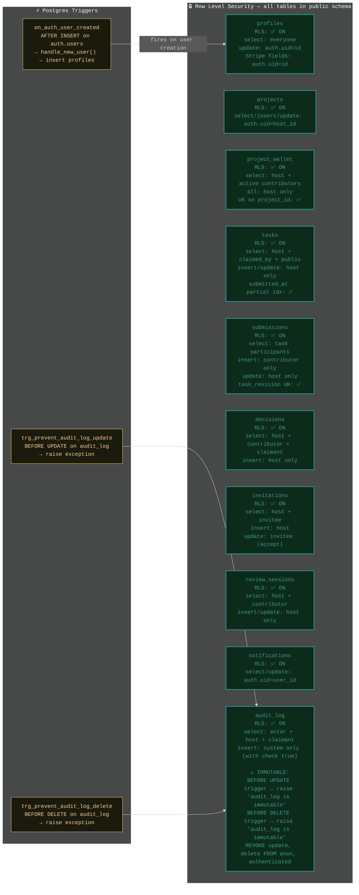
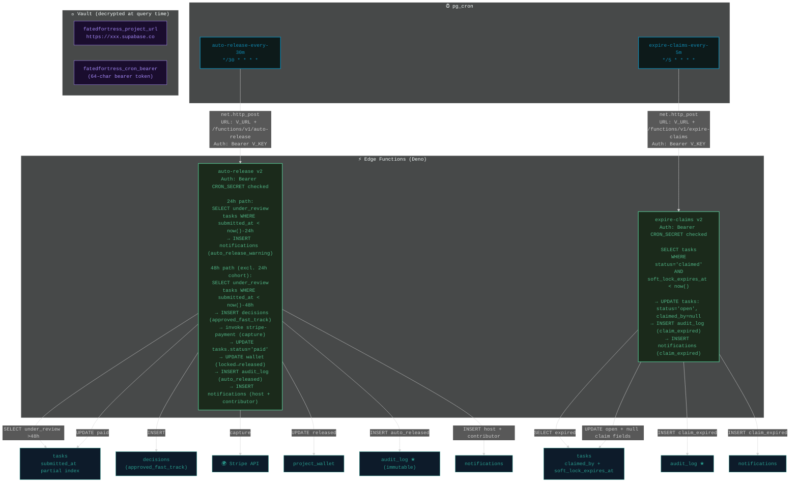
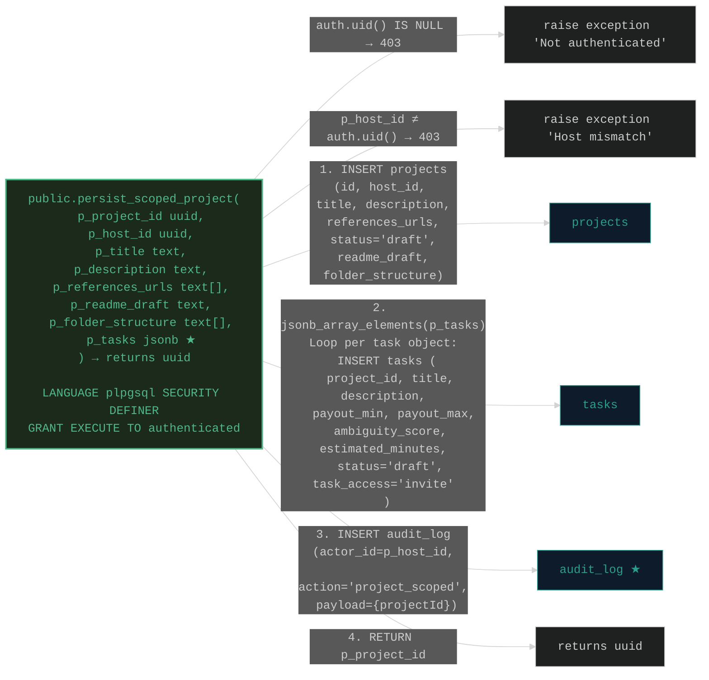

# Fated Fortress — System Diagram (v2.0)

---

## Supabase Architecture Overview

```mermaid
%%{init: {"theme": "dark", "fontFamily": "Geist Mono, monospace", "fontSize": 11}}%%
graph TB
    classDef db fill:#0d1b2a,stroke:#2a9d8f,stroke-width:2px,color:#2a9d8f
    classDef ef fill:#1b2a1b,stroke:#52b788,stroke-width:2px,color:#52b788
    classDef ext fill:#1a0d0d,stroke:#ef476f,stroke-width:1px,color:#ef476f
    classDef secret fill:#1a0d2e,stroke:#a78bfa,stroke-width:1px,color:#a78bfa
    classDef trigger fill:#1a1a0d,stroke:#ffd166,stroke-width:1px,color:#ffd166
    classDef cron fill:#0d1a1a,stroke:#118ab2,stroke-width:1px,color:#118ab2

    subgraph SupabaseProject["🗄️ Supabase Project: your-ref (region)"]
        direction TB

        %% ── Vault / Secrets ──────────────────────────────────────────────
        subgraph Vault["🔐 Vault — encrypted secrets for cron auth"]
            VAULT_URL["fatedfortress_project_url<br/>https://xxx.supabase.co"]:::secret
            VAULT_CRON["fatedfortress_cron_bearer<br/>64-char bearer token (CRON_SECRET)"]:::secret
        end

        %% ── Extensions ──────────────────────────────────────────────
        subgraph Extensions["⚙️ Postgres Extensions"]
            PG_CRON["pg_cron v1.6.4<br/>Job scheduler"]:::cron
            PG_NET["pg_net v0.20.0<br/>Async HTTP client (for cron → Edge)"]:::cron
            PG_VAULT["supabase_vault v0.3.1<br/>Encrypted secret storage"]:::cron
        end

        %% ── Cron Schedules ────────────────────────────────────────────
        subgraph CronJobs["⏰ pg_cron Jobs"]
            CJ_AUTO["auto-release-every-30m<br/>*/30 * * * * — net.http_post to auto-release Edge Fn"]:::cron
            CJ_CLAIM["expire-claims-every-5m<br/>*/5 * * * * — net.http_post to expire-claims Edge Fn"]:::cron
        end
        CJ_AUTO -->|"net.http_post<br/>URL: Vault decrypted + /functions/v1/auto-release<br/>Auth: Bearer fatedfortress_cron_bearer"| VAULT_CRON
        CJ_CLAIM -->|"net.http_post<br/>URL: Vault decrypted + /functions/v1/expire-claims<br/>Auth: Bearer fatedfortress_cron_bearer"| VAULT_CRON

        %% ── Edge Functions ────────────────────────────────────────────
        subgraph EdgeFunctions["⚡ Edge Functions (Deno Runtime)"]
            EF_AUTO["auto-release v2 ★<br/>Every 30 min (cron)<br/>24h warning → 48h auto-release<br/>Calls: stripe-payment, decisions,<br/>tasks, wallet, notifications, audit_log"]:::ef
            EF_EXPIRE["expire-claims v2<br/>Every 5 min (cron)<br/>Resets soft_lock_expired tasks<br/>→ status=open, clears claimed_by,<br/>notifies contributor"]:::ef
            EF_STRIPE_PY["stripe-payment v1<br/>create / capture / cancel / refund / create_transfer<br/>Uses: STRIPE_SECRET_KEY env var"]:::ef
            EF_STRIPE_ONB["stripe-connect-onboard v2<br/>Creates Stripe Connect Express account<br/>Reads: profiles.stripe_account_id<br/>Uses: auth.users.email + profiles.display_name"]:::ef
            EF_STRIPE_LNK["stripe-connect-link v1<br/>Generates Stripe onboarding account link<br/>Reads: stripe_account_id"]:::ef
        end

        EF_AUTO -->|"1. invoke stripe-payment (capture)"| EF_STRIPE_PY
        EF_AUTO -->|"2. insert decisions (approved_fast_track)"| decisions
        EF_AUTO -->|"3. update tasks.status=paid"| tasks
        EF_AUTO -->|"4. wallet locked→released"| wallet
        EF_AUTO -->|"5. audit_log (auto_released)"| audit_log
        EF_AUTO -->|"6. notify host + contributor"| notifications
    end

    EF_STRIPE_PY -->|"Stripe API"| StripeExt["🌍 Stripe Connect<br/>PaymentIntent capture<br/>10% application_fee"]:::ext
    EF_STRIPE_ONB -->|"Stripe API"| StripeExt
    EF_STRIPE_LNK -->|"Stripe API"| StripeExt

    VAULT_URL -.->|"URL for cron http_post URL construction"| CJ_AUTO
    VAULT_CRON -.->|"Bearer token for cron Authorization header"| CJ_AUTO
    VAULT_CRON -.->|"Bearer token for cron Authorization header"| CJ_CLAIM

    subgraph SupabaseDB["🗄️ Database Tables (all RLS enabled)"]
        profiles -->|"host_id / claimed_by / contributor_id"| tasks
        projects -->|"1:1 + FK"| wallet
        projects -->|"1:many"| tasks
        tasks -->|"1:many"| submissions
        tasks -->|"1:many"| review_sessions
        submissions -->|"1:many"| decisions
        submissions -->|"1:1"| review_sessions
    end
```



---

## Database Schema (ER Diagram)

```mermaid
%%{init: {"theme": "dark", "fontFamily": "Geist Mono, "fontSize": 9}}%%
erDiagram
    "auth.users" ||--o| "public.profiles" : "handle_new_user() trigger on INSERT"

    "public.profiles" {
        uuid id PK "→ auth.users(id)"
        text display_name ""
        text role "'host' | 'contributor'"
        text github_username ""
        text avatar_url ""
        text stripe_account_id "★ nullable (host Stripe Connect)"
        text contributor_stripe_account_id "★ nullable"
        decimal review_reliability "default 0"
        decimal approval_rate "default 0"
        decimal avg_revision_count "default 0"
        int avg_response_time_minutes "default 0"
        int total_approved "default 0"
        int total_submitted "default 0"
        int total_rejected "default 0"
        timestamptz created_at ""
    }

    "public.project_templates" {
        uuid id PK
        text title ""
        text description ""
        timestamptz created_at ""
    }

    "public.projects" {
        uuid id PK
        uuid host_id "→ profiles(id)"
        text title ""
        text description ""
        text[] references_urls "[]"
        uuid template_id "→ project_templates(id)"
        text readme_draft ""
        text[] folder_structure ""
        text status "'draft' | 'active' | 'completed'"
        timestamptz created_at ""
        timestamptz updated_at ""
    }

    "public.project_wallet" {
        uuid id PK
        uuid project_id UK "→ projects(id) unique"
        decimal deposited "default 0"
        decimal locked "default 0"
        decimal released "default 0"
        timestamptz created_at ""
        "available = deposited - locked - released (computed, not stored)"
    }

    "public.tasks" {
        uuid id PK
        uuid project_id "→ projects(id)"
        text title ""
        text description ""
        decimal payout_min "default 0"
        decimal payout_max "default 0"
        decimal approved_payout "★ denorm cache; source = decisions.approved_payout"
        decimal ambiguity_score ""
        int estimated_minutes ""
        text task_access "'invite' | 'public'"
        text status "'draft'→'open'→'claimed'→'submitted'→'under_review'→'revision_requested'→'paid'|'expired'"
        uuid claimed_by "→ profiles(id)"
        timestamptz claimed_at ""
        timestamptz soft_lock_expires_at "24h ownership window"
        timestamptz submitted_at "★ partial index (for auto-release cutoff)"
        timestamptz reviewed_at ""
        timestamptz created_at ""
        timestamptz updated_at ""
    }

    "public.invitations" {
        uuid id PK
        uuid project_id "→ projects(id)"
        uuid task_id "→ tasks(id)"
        text invited_email ""
        uuid invited_user_id "→ profiles(id)"
        text token UK "unique"
        timestamptz accepted_at ""
        timestamptz expires_at "default now()+7days"
        timestamptz created_at ""
    }

    "public.submissions" {
        uuid id PK
        uuid task_id "→ tasks(id)"
        uuid contributor_id "→ profiles(id)"
        text asset_url ""
        text payment_intent_id "★ nullable (Stripe manual capture)"
        text deliverable_type "'file'|'pr'|'code_patch'|'design_asset'|'text'|'audio'|'video'|'3d_model'|'figma_link'"
        text ai_summary ""
        int revision_number "default 1 (UK with task_id)"
        timestamptz created_at ""
        timestamptz updated_at ""
    }

    "public.decisions" {
        uuid id PK
        uuid submission_id "→ submissions(id)"
        uuid host_id "→ profiles(id)"
        text decision_reason "'requirements_not_met'|'quality_issue'|'scope_mismatch'|'missing_files'|'great_work'|'approved_fast_track'"
        text review_notes ""
        jsonb structured_feedback ""
        decimal approved_payout "★ authoritative source (tasks.approved_payout is denorm cache)"
        timestamptz revision_deadline ""
        timestamptz created_at ""
    }

    "public.review_sessions" {
        uuid id PK
        uuid task_id "→ tasks(id)"
        uuid submission_id "→ submissions(id)"
        uuid host_id "→ profiles(id)"
        uuid contributor_id "→ profiles(id)"
        text ydoc_id "Y.js doc ID"
        text status "'active'|'resolved'|'archived'"
        timestamptz created_at ""
        timestamptz updated_at ""
    }

    "public.notifications" {
        uuid id PK
        uuid user_id "→ profiles(id)"
        text type "'task_claimed'|'submission_received'|'revision_requested'|'payment_released'|'submission_rejected'|'claim_expired'|'verification_failed'|'auto_release_warning'|'auto_released'"
        uuid task_id "→ tasks(id)"
        bool read "default false"
        timestamptz created_at ""
    }

    "public.audit_log" {
        uuid id PK
        uuid actor_id "→ profiles(id)"
        uuid task_id "→ tasks(id)"
        text action "'claimed'|'submitted'|'approved'|'rejected'|'payment_released'|'revision_requested'|'task_created'|'task_published'|'verification_failed'|'auto_released'|'claim_expired'"
        jsonb payload "{}"
        timestamptz created_at ""
        "★ IMMUTABLE: UPDATE and DELETE blocked by triggers"
    }

    "public.profiles" ||--o{ "public.projects" : "host_id"
    "public.profiles" ||--o{ "public.tasks" : "claimed_by"
    "public.profiles" ||--o{ "public.submissions" : "contributor_id"
    "public.profiles" ||--o{ "public.decisions" : "host_id"
    "public.profiles" ||--o{ "public.notifications" : "user_id"
    "public.project_templates" ||--o{ "public.projects" : "template_id"
    "public.projects" ||--|{ "public.project_wallet" : "project_id 1:1"
    "public.projects" ||--|{ "public.tasks" : "project_id"
    "public.projects" ||--o{ "public.invitations" : "project_id"
    "public.invitations" ||--o{ "public.tasks" : "task_id"
    "public.tasks" ||--|{ "public.submissions" : "task_id"
    "public.tasks" ||--|{ "public.review_sessions" : "task_id"
    "public.tasks" ||--o{ "public.notifications" : "task_id"
    "public.tasks" ||--o{ "public.audit_log" : "task_id"
    "public.submissions" ||--|{ "public.decisions" : "submission_id"
    "public.submissions" ||--|{ "public.review_sessions" : "submission_id"
```

---

## RLS + Trigger Map



---

## Stripe Connect Payout Flow

```mermaid
%%{init: {"theme": "dark", "fontFamily": "Geist Mono, monospace", "fontSize": 10}}%%
sequenceDiagram
    actor H as Host
    actor C as Contributor
    actor FF as FatedFortress Frontend
    actor SU as Supabase Edge Fn
    actor ST as Stripe API

    rect #1b2a49
        Note over H,ST: CONNECT ONBOARDING (one-time per host)
        H->>FF: /settings → "Connect Stripe"
        FF->>SU: stripe-connect-onboard({ userId })
        SU->>ST: POST /accounts<br/>(type=express, country=US<br/>capabilities[card_payments]=active<br/>capabilities[transfers]=active
        ST-->>SU: { id: acct_xxx }
        SU->>FF: { stripeAccountId: acct_xxx }
        FF->>SU: profiles.update({ stripe_account_id: acct_xxx })
        H->>ST: Completes Stripe onboarding (browser redirect)
    end

    rect #0d1b2a
        Note over H,ST: CLAIM + SUBMIT (no money moves)
        H->>FF: Creates project + tasks
        C->>FF: browse /tasks
        C->>FF: claim task → tasks.status='claimed'
        C->>FF: submit deliverable
        FF->>SU: stripe-payment create({ amount, taskId, submissionId })
        SU->>ST: POST /payment_intents<br/>(capture_method=manual)
        ST-->>SU: { id: pi_xxx, client_secret }
        SU->>FF: Update submissions.payment_intent_id=pi_xxx
        Note over C,ST: No capture yet; funds not moved
    end

    rect #1b2a49
        Note over H,ST: RELEASE PAYOUT (only place capture happens)
        H->>FF: Reviews → Approve
        FF->>SU: releasePayout({ submissionId, approvedPayout, decisionReason })
        SU->>FF: 1. Insert decisions row
        SU->>ST: 2. POST /payment_intents/pi_xxx/capture<br/>application_fee=Math.round(approvedPayout×1000/10000)
        ST-->>SU: { status: 'succeeded' }
        SU->>FF: 3. tasks.status='paid'<br/>4. wallet locked→released<br/>5. audit_log<br/>6. notifications<br/>7. updateHostReliability
        Note over H,ST: Host receives transfer via Stripe Connect<br/>Platform keeps 10% application_fee
    end

    rect #0d1b2a
        Note over H,ST: AUTO-RELEASE (48h timeout)
        Note over SU: pg_cron fires auto-release (30min)
        SU->>FF: Find under_review tasks >48h (excl. 24h cohort)
        FF->>SU: invoke stripe-payment capture (approved_fast_track)
        SU->>ST: POST /payment_intents/pi_xxx/capture
        FF->>FF: Same wallet + notification steps
        Note over H,C: auto_released notification sent
    end

    rect #1b2a49
        Note over H,ST: REJECT / REVISION
        H->>FF: Reviews → Reject or Request Revision
        FF->>SU: rejectSubmission / requestRevision
        SU->>ST: POST /payment_intents/pi_xxx/cancel (reject only)
        FF->>FF: tasks.status='open' (back to queue)<br/>notifications sent to contributor
    end
```

---

## Autonomous Ops — Cron + Edge Functions



---

## persist_scoped_project RPC



---

## Key Design Decisions

| Decision | Rationale |
|---|---|
| **Stripe capture only in `releasePayout`** | Manual capture: no funds held on claim/submit; capture is the one atomic moment |
| **`decisions` is authoritative** | `submissions` has no decision columns; approved payout sourced from decisions |
| **`project_wallet.available` is computed** | `available = deposited - locked - released` — never stored, never stale |
| **Invite-first** | `?invite=<token>` URL param; invitation gate enforced at query/app level |
| **VERIFY before host queue** | Auto-reject saves host time; `verification_failed` notification |
| **Y.js = review sessions only** | `ydoc_id` is the boundary; not room-based general presence |
| **Supabase Realtime** | `tasks`, `notifications`, `audit_log` in `supabase_realtime` publication |
| **Audit log immutable** | `trg_prevent_audit_log_update/delete` + `revoke update/delete on anon, authenticated` |
| **10% Stripe `application_fee`** | `Math.round(amount × 1000 / 10000)` on every captured PaymentIntent |
| **Vault for cron auth** | `fatedfortress_project_url` + `fatedfortress_cron_bearer` in `supabase_vault`; pg_cron reads decrypted values |
| **24h cohort excluded from 48h** | `auto-release` release query excludes tasks already warned at 24h |
| **`soft_lock_expires_at`** | 24h window after claim; `expire-claims` reclaims if no submission |

---

## Migrations Applied (in order)

| Version | Name | Effect |
|---|---|---|
| `20260422_base_schema_v2` | Full schema | 11 tables, all RLS, all constraints, indexes, triggers |
| `20260422_post_refactor_v1_assertions` | Assertions | `decisions.decision_reason` constraint, wallet UK |
| `20260422_persist_blueprint` | RPC | `persist_scoped_project()` — atomic project+task creation |
| `20260422_security_realtime_cron` | Security + Cron | audit_log immutability triggers, realtime publication, pg_cron schedules, Vault secrets |
| `20260422_fix5_profiles_stripe_account_id` | Profiles stripe | `stripe_account_id` + `contributor_stripe_account_id` columns |
| `20260422_fix7_tasks_status_and_submitted_at_index` | Tasks constraints | Remove dead `approved`/`rejected` from status; `idx_tasks_submitted_at` |
| `20260422_fix2_persist_scoped_project` | RPC fix | Remove non-existent `deliverable_type` from tasks INSERT |

---

## Environment Variables Required

```env
# Supabase
VITE_SUPABASE_URL=https://YOUR_PROJECT_REF.supabase.co
VITE_SUPABASE_ANON_KEY=eyJ...   # public anon key from Supabase dashboard

# Stripe (set in Supabase Dashboard → Edge Functions → Secrets)
STRIPE_SECRET_KEY=sk_live_...          # server-side only
VITE_STRIPE_PUBLISHABLE_KEY=pk_live_... # client-side

# GitHub
VITE_GITHUB_CLIENT_ID=
GITHUB_TOKEN=                          # server-side (verify worker)

# Worker bridge
VITE_WORKER_ORIGIN=https://keys.fatedfortress.com

# Relay
__RELAY_ORIGIN__=wss://relay.fatedfortress.com
__RELAY_HTTP_ORIGIN__=https://relay.fatedfortress.com
```
