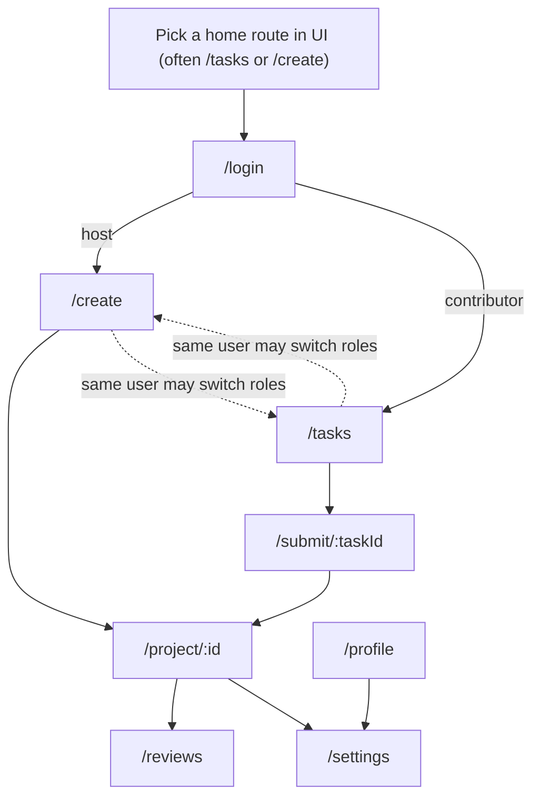

# UI creation map (Fated Fortress web)

Use these diagrams when designing screens, navigation, and empty/loading/error states. They reflect the current SPA router in `apps/web/src/main.ts` (one `#app` root, per-route mount/teardown).

## 1) Information architecture (routes → purpose)

Intended to answer: *“What pages exist, who uses them, and what job does each do?”*

```mermaid
%%{init: {"flowchart": {"curve": "linear"}}}%%
flowchart TB
  subgraph Shell["App shell (all routes)"]
    S["`#app` container — cleared on every navigation`"]
    DS["`design-system.css + ff.css`"]
    A["`Sentry` + `auth session` + optional `realtime notifications`"]
  end

  subgraph Public["Entry / account"]
    L["`/login` — sign in (Supabase)"]
  end

  subgraph Host["Host journeys"]
    C["`/create` — brief → SCOPE → task drafts → publish / fund`"]
    R["`/reviews` — review queue, decisions, Y.js review session`"]
    Pj["`/project/:id` — project detail, wallet, activity`"]
  end

  subgraph Contributor["Contributor journeys"]
    T["`/tasks` — browse / claim`"]
    Su["`/submit/:taskId` — upload, verify, submit`"]
  end

  subgraph Account["Account & integrations"]
    Pr["`/profile` — contributor/host profile, reliability`"]
    St["`/settings` — GitHub + Stripe Connect, triggers`"]
    G["`/github/callback` — OAuth return (not a nav item)`"]
  end

  Shell --> L
  L --> C
  L --> T
  C --> Pj
  T --> Su
  Su --> R
  Pj --> R
  L --> Pr
  L --> St
  St --> G
```

**UI design prompts this unlocks**
- **Global affordances** that should be consistent: auth state, errors/toasts, “where am I?”, and notification surfacing.
- **Two mental models** (host vs contributor) with different primary CTAs, even when both share `/profile` and `/settings`.

## 2) Core flows (what to wire into each screen)

This is a *journey* view: good for “what states must the UI show?” (loading, claim lock, under review, paid, etc.).

```mermaid
flowchart LR
  subgraph HostFlow["Host: publish → pay → review"]
    H1["`/create` — draft tasks"] --> H2["Fund wallet / publish tasks"]
    H2 --> H3["`/reviews` — Approve / reject / request revision`"]
  end

  subgraph ContribFlow["Contributor: find → do → deliver"]
    C1["`/tasks` — claim (PaymentIntent/lock semantics)`"] --> C2["`/submit/:taskId` — upload/verify`"]
    C2 --> C3["`Wait: under_review` (notifications)`"]
  end

  C3 --> H3
  H3 --> C4["`Outcome: paid / revision`"]
```

**UI design prompts this unlocks**
- **Handoff points** that need explicit screen language: *after claim*, *after submit*, *while host reviews*, *after decision*.
- **Asynchronous reality**: contributors may live in “waiting” states; hosts live in “queue/attention” states.

## 3) Navigation map (how users should move, conceptually)

Use this to avoid “orphan” pages and to place persistent navigation in the shared shell (top nav, side nav, or minimal link row — whatever you choose).



## 4) Cross-cutting “non-page” systems that become UI

These influence layout and affordances (badges, connection status, collaboration UI).

```mermaid
flowchart LR
  N["`Realtime notifications (if logged in)`"]
  Y["`Y.js + relay WebRTC`"]
  R["`/reviews` collaboration surface`"]
  N --> B["`Global: inbox/toast/bell`"]
  Y --> R
```

---

### Notes for implementers
- The SPA is **not** React: each `pages/*.ts` module owns DOM for a route; treat shared UI as **extracted building blocks** in `ui/` and styles in `styles/`, not a framework router.
- Favor a **role-aware home**: contributors land on task discovery; hosts land on create/project—your shell navigation should make that explicit to reduce cognitive load.
